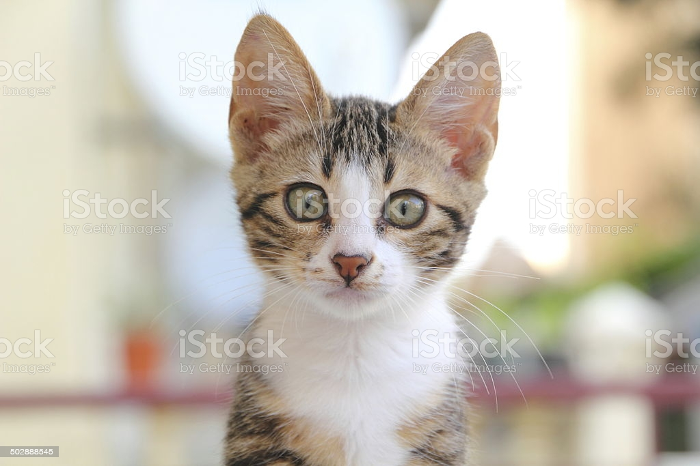

# This is Jeff's awesome website 
What if I add some text here...?


## Here's a subsection
And here's some additional text...
```{r}
rnorm(10)
```


## Links to other websites
    by format: [text for link](address.of.link)
(if the website has multiple pages, use this way to link them together)

* [Google](https://www.google.com)   
* [P8105](https://www.p8105.com)

## Local image
  by formate: ``

Here is my cat, ted:

(use html directly, since can change jpg style easier): \newline


## Link to page within the site
    by format: [text for link](name of .html)
[About me](about.html)


## _site.yml
All our pages have styling, output, and structure coming from page-specific YAML. Create your _site.yml to have one set of rules that apply site-wide.

How to create: Create _site.yml file by going to : 
        File > New File > Text file. save the file as _site.yml in project’s home folder.

theme: change the background of website (`default theme` in p8105.com)
```{r}
#添加标题/恩扭选项在网页上，使得两个页面可以相连接
```

## Quarterly Results {.tabset}

### By Product
This is my first tab

### By Region

This is my second tab

## This is a new section
Really great